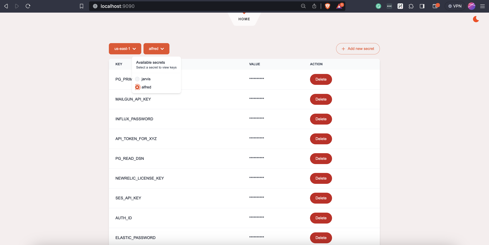

# ShieldedSecrets  
 

Shielded Secret is an open-source project that aims to simplify and secure secret management using AWS Secret Manager. With this tool, you can empower your users and developers to update secrets without exposing sensitive information. Say goodbye to the wait times and bottlenecks that often occur when SRE/DevOps teams are responsible for secret updates. Shielded Secret is designed to break down those silos and enable smoother deployments.

The backend filters out the values before transmitting them to the frontend, preventing users from viewing these values. Users can only perform actions like adding, deleting, and updating secrets. One can enhance interface security by setting the ALLOWED_IPS environment variable to permit only specified VPN addresses. We're also in the process of implementing basic authentication and incorporating TLS support via Let's Encrypt. Alternatively, you can easily achieve this by placing a reverse proxy in front of the application. Additionally, consider using Google Identity-Aware Proxy (IAP) services to introduce Google Single Sign-On (SSO) for added security.

### Motivation
Reddit [thread](https://www.reddit.com/r/devops/comments/17eglv7/tooling_around_updating_aws_secret_manager_secrets/)

### Installation and usage
```sh
# Update env variables in run.sh & execute the binary
./run.sh
```

### Contributing

Refer to [CONTRIBUTING.md](https://github.com/roshan8/shielded-secrets/blob/main/CONTRIBUTING.md)